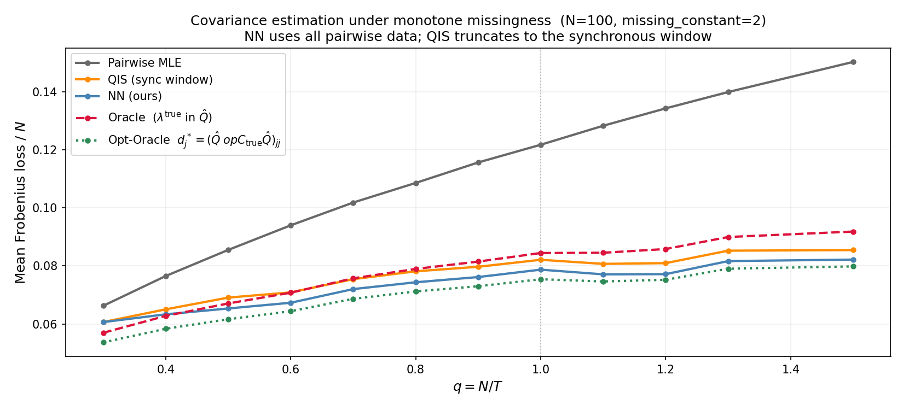
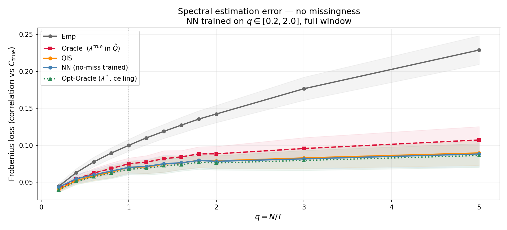
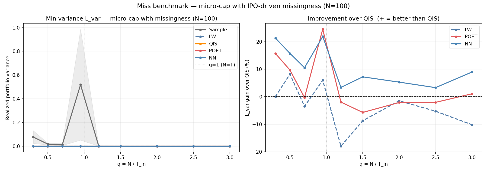
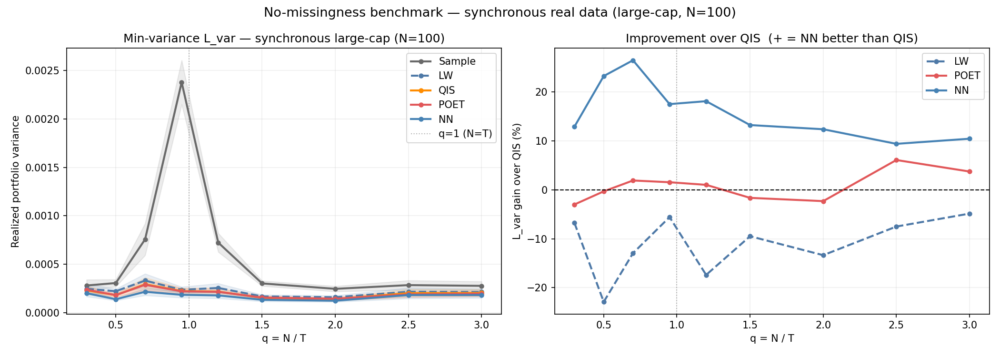

# Covariance Matrix Cleaning with Missing Data

Estimate and denoise covariance matrices from return matrices with **monotone missing values** using a BiGRU neural network.

## Problem

Given an $N \times T$ return matrix where each asset is unobserved from the start up to some random cutoff (monotone missingness), classical estimators fail:

- **Pairwise MLE** — non-PSD, produces negative eigenvalues
- **QIS** — requires a synchronous window, discards all asynchronous history; degrades severely as the sync window shrinks

The goal is a PSD covariance estimate that exploits the full asynchronous history.

## Solution

A **BiGRU denoiser** maps the empirical eigenspectrum (with missingness features) to cleaned eigenvalues, guaranteeing a PSD result. The eigenvectors are left unchanged; only eigenvalues are corrected.

Each eigenvalue $\lambda_j$ is accompanied by 4 auxiliary features:

| Feature | Description |
|---|---|
| $j/N$ | Normalized rank position |
| $q_j^{\text{eff}}$ | Effective ratio $N / ((1 - \tilde{T}_j^{\min}) \cdot T)$ |
| $\text{IPR}_j$ | Inverse participation ratio (eigenvector localization) |
| $z_j^{\text{MP}}$ | MP z-score: distance above the bulk edge |

Training uses synthetic data from an inverse-Wishart generator with random monotone masks, cosine LR decay, and gradient accumulation over diverse $(N, q)$ configurations.

## Results

### Synthetic data

**With missingness** — NN outperforms QIS across the full $q$ range by exploiting asynchronous observations that QIS discards:



**Without missingness** — baseline on clean synchronous data:



### Real data

**With missingness:**



**Without missingness:**



## Repository structure

```
data/           dataloader and real data pipeline
estimator/      MLE, QIS, NLS, pairwise PSD, POET, Shaffer
models/         BiGRU architecture, losses, trained weights
training/       trainer (synthetic and real data)
results/        comparison tables and plot utilities
notebooks/      evaluation notebooks (synthetic / real, miss / nomiss)
scripts/        training, benchmark, ablation, and analysis scripts
```

## Trained weights

| File | Description |
|---|---|
| `bigru_weights_syntheticdata.weights.h5` | Synthetic data, with missingness |
| `bigru_weights_nomiss.weights.h5` | Synthetic data, no missingness |
| `bigru_weights_realdata.weights.h5` | Real data fine-tune, with missingness |
| `bigru_weights_realdata_nomiss.weights.h5` | Real data fine-tune, no missingness |

## Setup

```bash
python -m venv .venv
source .venv/bin/activate
pip install -r requirement.txt
```

Requires Python 3.11, TensorFlow 2.20, NumPy, SciPy, scikit-learn.

## Reproducing results

```bash
# Train (synthetic → real fine-tune)
.venv/bin/python scripts/train_syntheticdata.py
.venv/bin/python scripts/train_realdata.py

# Benchmark
.venv/bin/python scripts/benchmark_miss.py
.venv/bin/python scripts/benchmark_nomiss.py

# Verify all quantitative claims
.venv/bin/python scripts/verify_claims.py
```
